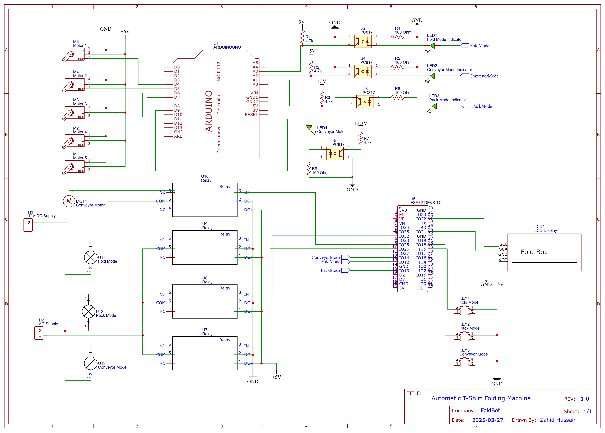

# 🤖 FoldBot – Automated Clothes Folding Machine

## Final Year Project (FYP)

**FoldBot** is an automated clothes folding system designed to reduce manual effort, improve folding consistency, and demonstrate the practical application of **embedded systems, automation, and mechatronics**.
The system integrates mechanical folding arms with an embedded control unit to autonomously fold garments with minimal human intervention.

This project was developed as a **Final Year Project (FYP)** and focuses on real-world automation challenges including motor control, sequencing, mechanical alignment, and system reliability.



---

## 📌 Problem Statement

Manual clothes folding is:

* Time-consuming
* Labor-intensive
* Inconsistent in quality

In environments such as **laundries, hospitals, hostels, and garment facilities**, repetitive folding leads to inefficiency and human fatigue.

**FoldBot** addresses this problem by providing a **low-cost, embedded-system-based automated solution** capable of folding clothes accurately using controlled mechanical motion.

---

## 🎯 Project Objectives

* Design a **fully automated clothes folding mechanism**
* Implement **embedded control logic** for precise motion sequencing
* Integrate **motors, sensors, and mechanical arms**
* Demonstrate a **working prototype** suitable for small-scale automation
* Apply embedded systems knowledge to a real mechanical process

---

## ⚙️ System Overview

FoldBot consists of three main subsystems:

1. **Mechanical Folding Structure**
2. **Embedded Control System**
3. **Power and Drive System**

The system operates by placing a garment on the folding platform, after which a predefined sequence of motor-driven arms folds the cloth into a compact form.

---

## 🧠 Working Principle

1. The user places a garment on the folding base.
2. The system is initialized via the control unit.
3. Motors activate in a **predefined sequence**.
4. Mechanical arms fold the cloth step-by-step:

   * Left fold
   * Right fold
   * Bottom fold
5. After completing the sequence, the folded cloth is ready for removal.
6. The system resets for the next operation.

All movements are **timed and synchronized** to ensure consistent folding.

---

## 🧩 Hardware Components

* **Microcontroller Unit (MCU)**
  Controls the entire folding sequence and motor timing.

* **DC / Servo Motors**
  Used to drive folding arms with controlled motion.

* **Motor Driver Module**
  Interfaces motors with the microcontroller and provides sufficient current.

* **Mechanical Folding Arms**
  Custom-built structure to physically fold garments.

* **Power Supply Unit**
  Provides regulated power to the control system and motors.

* **Frame & Base Platform**
  Supports mechanical stability and alignment.

---

## 💻 Software Architecture

The embedded firmware follows a **state-based control logic**:

### Core Software Functions:

* System initialization
* Motor sequencing logic
* Timing and delay control
* Safe reset after operation

### Control Flow:

```
START
 → Initialize MCU & Motors
 → Wait for Start Command
 → Execute Folding Sequence
 → Stop Motors
 → Reset System
 → READY
```

The code ensures:

* No overlapping motor actions
* Safe delays between folds
* Repeatable and predictable operation

## 🏁 Conclusion

FoldBot successfully demonstrates how embedded systems and automation can be applied to solve practical, repetitive tasks. The project validates the integration of hardware, firmware, and mechanical systems into a working automated solution and provides a strong foundation for future industrial-scale enhancements.
